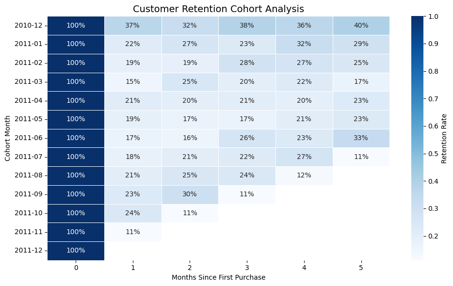
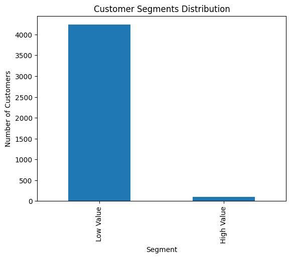
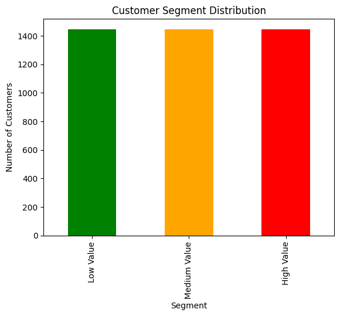

# customer-retention-and-clv-analysis
Python-based customer retention and CLV analysis project featuring cohort analysis, segmentation, and actionable business insights from real-world transactional data.

---

# Customer Retention & CLV Analysis

## Overview

This project analyzes customer behavior using **Cohort Analysis and Customer Lifetime Value (CLV)** on real-world transactional data. The goal is to understand retention patterns, identify high-value customers, and generate actionable business insights.

---

## Objectives

* Analyze customer retention over time
* Measure customer lifetime value (CLV)
* Segment customers based on revenue contribution
* Identify key drivers of customer behavior

---

## Dataset

* Online Retail Dataset (UCI)
* Contains transactional data including:

  * InvoiceNo
  * CustomerID
  * InvoiceDate
  * Quantity
  * UnitPrice
  * Country

---

## Tools & Technologies

* Python (Pandas, NumPy)
* Matplotlib & Seaborn (Visualization)
* Data Cleaning & Transformation

---

## Data Cleaning Steps

* Removed missing CustomerID values
* Filtered invalid transactions (Quantity ≤ 0, UnitPrice ≤ 0)
* Converted InvoiceDate to datetime format
* Removed duplicate records
* Created Revenue column

---

## Key Analysis

### 1. Cohort Analysis

* Grouped customers by first purchase month
* Measured retention over time
* Built cohort retention matrix

### 2. Customer Lifetime Value (CLV)

* Calculated total revenue per customer
* Identified high-value vs low-value customers

### 3. Customer Segmentation

* Segmented customers using quantiles:

  * Low Value
  * Medium Value
  * High Value

---

## Key Insights

* Customer retention drops sharply after the first purchase
* Only ~20–30% of customers return after initial purchase
* A small percentage of customers generate most of the revenue
* Business performance is highly dependent on high-value customers
* Early engagement plays a critical role in retention

---

## Business Recommendations

* Improve onboarding and early customer experience
* Offer incentives for repeat purchases
* Focus retention strategies on high-value customers
* Implement targeted marketing for different customer segments

---

## Visualizations

### Cohort Retention Heatmap



### CLV Distribution



### Customer Segment Distribution



---

## Project Structure

```
customer-retention-and-clv-analysis
│
├── data
│   └── online_retail.csv
│
├── notebooks
│   └── cleandata.ipynb
│
├── outputs
│   ├── cohort_heatmap.png
│   ├── clv_distribution.png
│   └── segment_distribution.png
│
└── README.md
```

---

## Conclusion

This project demonstrates how data analysis techniques like cohort analysis and CLV can provide deep insights into customer behavior. These insights can help businesses improve retention strategies and maximize revenue.

---

## Author

Mohit Choudhary
LinkedIn: [https://www.linkedin.com/in/mohitchoudhary2004](https://www.linkedin.com/in/mohitchoudhary2004)
